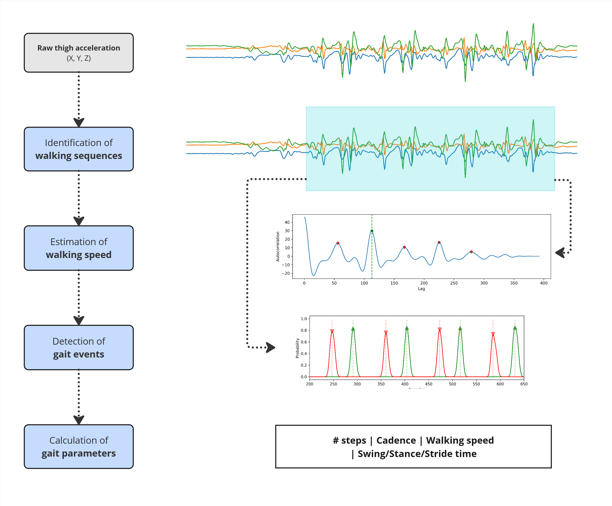

# TWAGA: Thigh-Worn Accelerometer Gait Analysis

Thigh-worn accelerometers are becoming more and more popular in physical activity research because they let researchers monitor how people behave physically in real-world settings. Several large-scale cohort studies in the Prospective Physical Activity, Sitting and Sleep consortium (ProPASS) have now started using thigh-worn accelerometers. Data from these devices can be used to classify different types of activity and postures when they're used with data-driven algorithms. This can help researchers to find out more about how different activities affect our health.

TWAGA represents a new pipeline for analysing human gait using raw data from a single thigh-worn accelerometer. TWAGA combines an activity classification model with subsequent walking speed estimation and gait event detection algorithms. The pipeline is building upon previous research results by myself [[Lendt et al. 2024](https://doi.org/10.1186/s12966-024-01646-y)], Loubna Baroudi [[Baroudi et al. 2020](https://doi.org/10.3389/fspor.2020.583848)] and Robbin Romijnders [[Romijnders et al. 2023](https://doi.org/10.3389/fneur.2023.1247532)].

The developed pipeline involves several key steps:

1. **Pre-processing**: We resample and filter the raw acceleration signal to a common sampling frequency.
2. **Walking sequence detection**: An activity classification model identifies walking sequences based on fixed time-intervals (4 seconds) of acceleration data. Additional smoothing of the classification labels is performed to reduce false negative predictions.
3. **Walking speed estimation:** The walking speed is estimated by exploiting the relationship between stride frequency and walking speed. Stride frequency is estimated using an autocorrelation approach.
4. **Gait event prediction**: A second model predicts the probability for gait events for each timepoint within each walking sequence. Gait events are identified based on the probability distributions. Identified gait events are filtered using heuristic approaches.
5. **Gait analysis**: Gait-specific parameters (e.g. stride time, walking speed, duty factor) are calculated for each stride and then summarised for each walking sequence.



<br/>

## 💻 Code

Functions to perform activity classification 🚶🏽‍➡️, walking speed estimation 🏃🏽‍➡️ and gait event detection 👣 can be found inside ```twaga.py```. Models for activity classification and gait event detection are inside the ```models``` folder. As of now, the functions for extracting gait-specific parameters (i.e. calculating bout-wise stride time, walking speed etc.) are not uploaded due to time constrains.

<br/>

## 📄 Papers

Lendt, C., Grimmer, M., Froböse, I., & Stewart, T. (2025). Gait Analysis for Thigh-Worn Accelerometry A Data Processing Pipeline using Data-Driven Approaches. medRxiv. https://doi.org/10.1101/2025.11.18.25339671

Lendt, C., Hansen, N., Froböse, I., & Stewart, T. (2024). Composite activity type and stride-specific energy expenditure estimation model for thigh-worn accelerometry. International Journal of Behavioral Nutrition and Physical Activity, 21(1), 99. https://doi.org/10.1186/s12966-024-01646-y

<br/>

Some additional information regarding the gait event detection and activity type classification can be found here:

Lendt, C., & Stewart, T. (2024). Gait Event Detection During Walking Using Deep Learning and Thigh-Worn Accelerometry, ISBS Proceedings Archive: Vol. 42: Iss. 1, Article 165. Available at: https://commons.nmu.edu/isbs/vol42/iss1/165

<br/>

## 🔓 Open data

This pipeline has been developed and validated using several open datasets:

* TWAGA [[Zenodo](https://doi.org/10.5281/zenodo.17629130)] - Thigh acceleration and GRF from force-sensing insoles.
* HARTH and HAR70+ [[GitHub](https://github.com/ntnu-ai-lab/harth-ml-experiments)] - Thigh acceleration and activity labels from video annotations.
* WearGait-PD [[Synapse](https://www.synapse.org/Synapse:syn52540892/wiki/623751)] - IMU data and GRF from force-sensing insoles.
* Warmerdam [[Figshare](https://doi.org/10.6084/m9.figshare.20238006.v2)] - IMU and motion tracking data.

<br/>

## 💸 Funding

TWAGA is partially based upon the results of the research project 'Estimation of activity induced energy expenditure using thigh-worn accelerometry and machine learning approaches', funded by the Internal Research Funds of the German Sport University Cologne. Some of the underlying work has been done while being supported by a fellowship of the German Academic Exchange Service (DAAD).

<br/>

## 🙌🏽 Acknowledgements

We appreciate all research teams who made the extra effort to openly share their datasets as well as all participants in all underlying studies.


